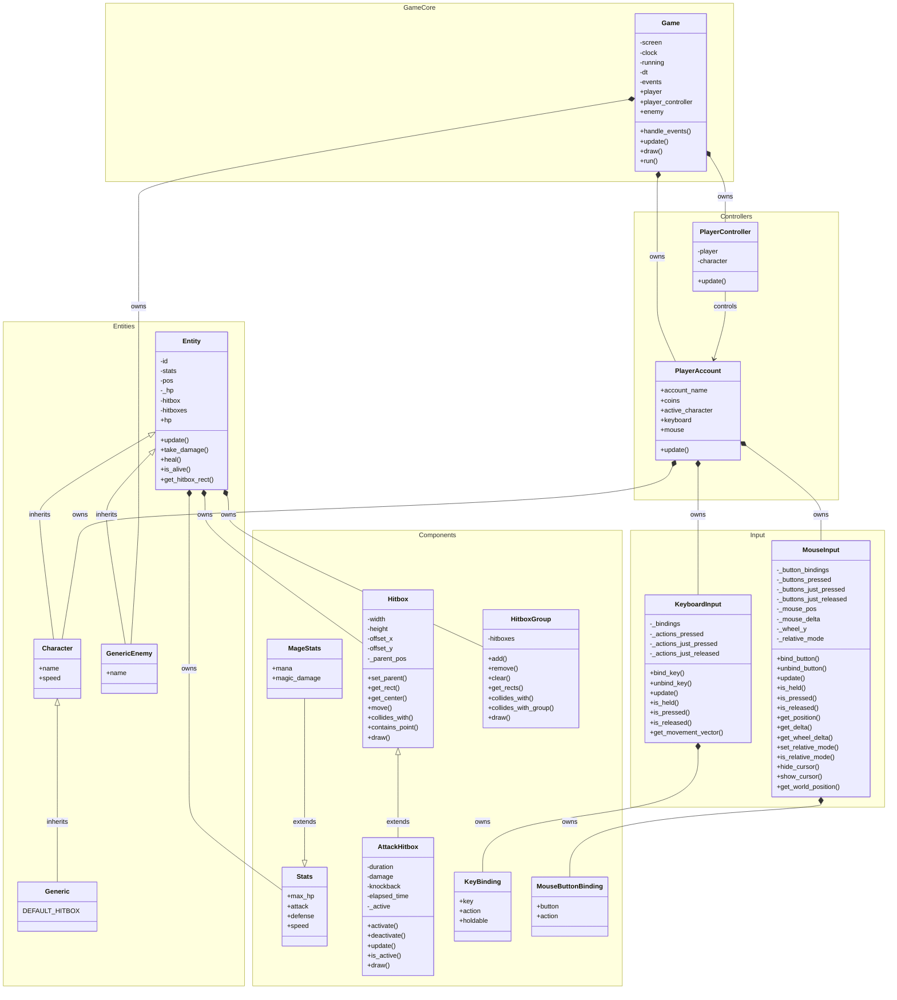

```mermaid
classDiagram
    namespace GameCore {
        class Game {
            -screen
            -clock
            -running
            -dt
            -events
            +player
            +player_controller
            +enemy
            +handle_events()
            +update()
            +draw()
            +run()
        }
    }

    namespace Entities {
        class Entity {
            -id
            -stats
            -pos
            -_hp
            -hitbox
            -hitboxes
            +hp
            +update()
            +take_damage()
            +heal()
            +is_alive()
            +get_hitbox_rect()
        }
        
        class Character {
            +name
            +speed
        }
        
        class Generic {
            DEFAULT_HITBOX
        }

        class GenericEnemy {
            +name
        }
    }

    namespace Components {
        class Stats {
            +max_hp
            +attack
            +defense
            +speed
        }
        
        class MageStats {
            +mana
            +magic_damage
        }

        class Hitbox {
            -width
            -height
            -offset_x
            -offset_y
            -_parent_pos
            +set_parent()
            +get_rect()
            +get_center()
            +move()
            +collides_with()
            +contains_point()
            +draw()
        }

        class HitboxGroup {
            -hitboxes
            +add()
            +remove()
            +clear()
            +get_rects()
            +collides_with()
            +collides_with_group()
            +draw()
        }

        class AttackHitbox {
            -duration
            -damage
            -knockback
            -elapsed_time
            -_active
            +activate()
            +deactivate()
            +update()
            +is_active()
            +draw()
        }
        
        class KeyBinding {
            +key
            +action
            +holdable
        }
        
        class MouseButtonBinding {
            +button
            +action
        }
    }

    namespace Input {
        class KeyboardInput {
            -_bindings
            -_actions_pressed
            -_actions_just_pressed
            -_actions_just_released
            +bind_key()
            +unbind_key()
            +update()
            +is_held()
            +is_pressed()
            +is_released()
            +get_movement_vector()
        }
        
        class MouseInput {
            -_button_bindings
            -_buttons_pressed
            -_buttons_just_pressed
            -_buttons_just_released
            -_mouse_pos
            -_mouse_delta
            -_wheel_y
            -_relative_mode
            +bind_button()
            +unbind_button()
            +update()
            +is_held()
            +is_pressed()
            +is_released()
            +get_position()
            +get_delta()
            +get_wheel_delta()
            +set_relative_mode()
            +is_relative_mode()
            +hide_cursor()
            +show_cursor()
            +get_world_position()
        }
    }

    namespace Controllers {
        class PlayerAccount {
            +account_name
            +coins
            +active_character
            +keyboard
            +mouse
            +update()
        }
        
        class PlayerController {
            -player
            -character
            +update()
        }
    }

    %% Inheritance
    MageStats --|> Stats : extends
    Entity <|-- Character : inherits
    Entity <|-- GenericEnemy : inherits
    Character <|-- Generic : inherits
    Hitbox <|-- AttackHitbox : extends

    %% Composition/Aggregation
    Game *-- PlayerAccount : owns
    Game *-- PlayerController : owns
    Game *-- GenericEnemy : owns
    PlayerAccount *-- Character : owns
    PlayerAccount *-- KeyboardInput : owns
    PlayerAccount *-- MouseInput : owns
    PlayerController --> PlayerAccount : controls
    Entity *-- Stats : owns
    Entity *-- Hitbox : owns
    Entity *-- HitboxGroup : owns
    KeyboardInput *-- KeyBinding : owns
    MouseInput *-- MouseButtonBinding : owns
```
