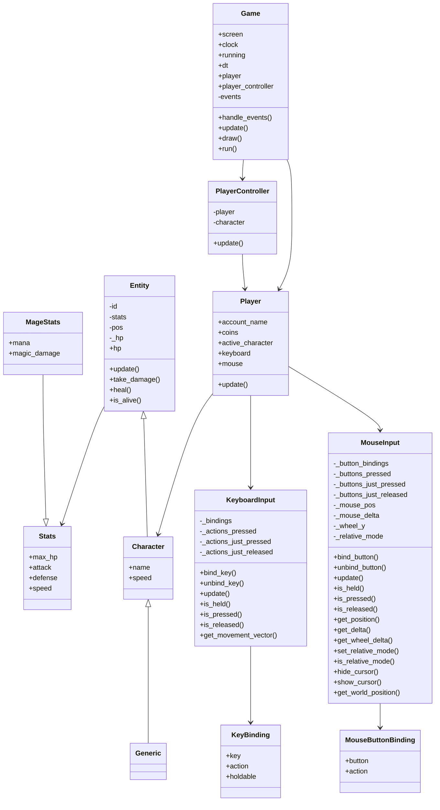

```mermaid
classDiagram
    class Stats {
        +max_hp
        +attack
        +defense
        +speed
    }
    
    class MageStats {
        +mana
        +magic_damage
    }
    
    class KeyBinding {
        +key
        +action
        +holdable
    }
    
    class MouseButtonBinding {
        +button
        +action
    }

    MageStats --|> Stats
    
    class Entity {
        -id
        -stats
        -pos
        -_hp
        +hp
        +update()
        +take_damage()
        +heal()
        +is_alive()
    }
    
    class Character {
        +name
        +speed
    }
    
    class Generic
    
    Entity <|-- Character
    Character <|-- Generic
    
    class Player {
        +account_name
        +coins
        +active_character
        +keyboard
        +mouse
        +update()
    }
    
    class PlayerController {
        -player
        -character
        +update()
    }
    
    PlayerController --> Player
    
    class KeyboardInput {
        -_bindings
        -_actions_pressed
        -_actions_just_pressed
        -_actions_just_released
        +bind_key()
        +unbind_key()
        +update()
        +is_held()
        +is_pressed()
        +is_released()
        +get_movement_vector()
    }
    
    class MouseInput {
        -_button_bindings
        -_buttons_pressed
        -_buttons_just_pressed
        -_buttons_just_released
        -_mouse_pos
        -_mouse_delta
        -_wheel_y
        -_relative_mode
        +bind_button()
        +unbind_button()
        +update()
        +is_held()
        +is_pressed()
        +is_released()
        +get_position()
        +get_delta()
        +get_wheel_delta()
        +set_relative_mode()
        +is_relative_mode()
        +hide_cursor()
        +show_cursor()
        +get_world_position()
    }
    
    class Game {
        +screen
        +clock
        +running
        +dt
        +player
        +player_controller
        -events
        +handle_events()
        +update()
        +draw()
        +run()
    }
    
    Entity --> Stats
    Player --> Character
    Player --> KeyboardInput
    Player --> MouseInput
    Game --> Player
    Game --> PlayerController
    KeyboardInput --> KeyBinding
    MouseInput --> MouseButtonBinding
```
